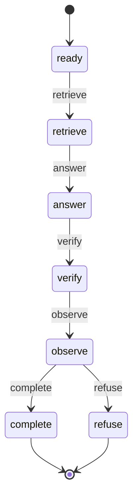

# PrimeQA Hybrid Optional Sidecar-Agent Entrypoint Protocol

Stage138 freezes an optional entrypoint boundary and an executable finite-state
protocol around the Stage137-validated sidecar agent orchestrator. The state
machine is real code and both terminal paths were executed during the freeze.
The business entrypoint is deliberately not wired into runtime in this stage.

## Command

```text
python scripts/freeze_primeqa_hybrid_sidecar_agent_entrypoint_protocol.py --user-confirmed-protocol --confirmation-note "user confirmed Stage138 optional sidecar-agent entrypoint and executable action-state protocol freeze after Stage137 validation; protocol-only runtime entrypoint not wired; test locked; no final metrics; runtime defaults unchanged; no retries or fallback strategies"
```

The process ran once and completed naturally.

## Source Boundary

Stage138 reads only:

```text
artifacts/primeqa_hybrid_sidecar_agent_orchestrator_validation_stage137.json
```

It does not load split files, corpus documents, candidate rows, model outputs,
runtime content handles, gold labels, or test data. It does not run retrieval,
answer generation, verification, train/dev evaluation, or final-test metrics.

Inherited Stage137 facts:

```text
source guards: 36 / 36 passed
train rows: 562
dev rows: 121
answer-path identity violations: 0
sidecar answer-path leaks or primary overlaps: 0
public trace violations: 0
train append opportunities / sidecar captures: 9 / 0
dev append opportunities / sidecar captures: 1 / 0
sidecar effectiveness: safe_but_neutral
test split loaded: false
runtime defaults changed: false
fallback strategies enabled: false
```

## Executable State Machine

The protocol uses a polymorphic `SidecarAgentTransitionPolicy` port and a fixed
`FrozenSidecarAgentTransitionPolicy`. `SidecarAgentActionStateMachine` owns the
current state and immutable public transition trace.



Frozen properties:

```text
states: ready, retrieve, answer, verify, observe, complete, refuse
allowed transitions: 6
terminal states: complete, refuse
transition loops: none
retry actions: none
fallback transitions: none
invalid transition behavior: raise without state change
```

The accepted canonical path is:

```text
retrieve -> answer -> verify -> observe -> complete
```

The refused canonical path is:

```text
retrieve -> answer -> verify -> observe -> refuse
```

The `observe` action is a post-verification diagnostic publication state. It
does not authorize sidecar candidates to enter answer generation or answer
verification. A verified refusal terminates directly after observation; it
does not retry retrieval and does not activate a fallback answer path.

## Entrypoint Boundary

```text
optional entrypoint: true
explicit activation required: true
registered as runtime default: false
runtime entrypoint implemented: false
runtime action order validated: false
runtime defaultization allowed: false
test access allowed: false
retry actions allowed: false
fallback strategies allowed: false
```

Stage138 reuses the identity and channel contract of:

```text
stage116_primary_plus_stage128_sidecar_agent_orchestrator_v1
```

The frozen answer channel remains `stage116_primary_answer_context`; the
verification channel remains `stage116_prefix_verification_context`; the
sidecar channel remains diagnostic only. Stage138 does not claim that the
runtime orchestrator emitted these action states in real execution. That is a
Stage139 implementation and validation requirement.

## Guard Result

```text
status: primeqa_hybrid_optional_sidecar_agent_entrypoint_protocol_frozen
guard checks: 31 / 31 passed
failed checks: []
optional agent entrypoint protocol frozen: true
state machine executable: true
runtime entrypoint implemented: false
runtime action order validated: false
can implement optional agent entrypoint now: true
can claim citation-verification effectiveness: false
can claim answer-quality improvement: false
can claim retrieval improvement: false
can open final test gate now: false
can run final test metrics now: false
can use test for tuning: false
runtime defaultization allowed now: false
retry actions enabled: false
fallback strategies enabled: false
default runtime policy: unchanged
public-safe forbidden keys: []
```

## Visualizations

```text
artifacts/primeqa_hybrid_optional_sidecar_agent_entrypoint_protocol_stage138_visuals/stage138_stage137_identity_isolation_counts.svg
artifacts/primeqa_hybrid_optional_sidecar_agent_entrypoint_protocol_stage138_visuals/stage138_sidecar_opportunity_capture.svg
artifacts/primeqa_hybrid_optional_sidecar_agent_entrypoint_protocol_stage138_visuals/stage138_state_outdegree.svg
artifacts/primeqa_hybrid_optional_sidecar_agent_entrypoint_protocol_stage138_visuals/stage138_entrypoint_permission_flags.svg
artifacts/primeqa_hybrid_optional_sidecar_agent_entrypoint_protocol_stage138_visuals/stage138_decision_flags.svg
artifacts/primeqa_hybrid_optional_sidecar_agent_entrypoint_protocol_stage138_visuals/stage138_guard_check_status.svg
```

The JSON report and SVGs are private local artifacts under the ignored
`artifacts/` directory. Only public-safe aggregate protocol documentation is
committed.

## Repository Verification

```text
targeted Stage138 pytest: 10 passed
Stage136-138 integration pytest: 31 passed
full repository ruff check: passed
Stage138 Python format check: 3 files already formatted
full repository pytest: 419 passed
git diff check: passed
```

`ruff format --check .` was also run and reported 314 pre-existing Python
files that would be reformatted by Ruff 0.15.21. None of the three Stage138
Python files was in that list. Stage138 does not bulk-reformat those unrelated
historical files, so the repository-wide format check is honestly recorded as
not clean while the changed-file format check passes.

## Decision

The optional entrypoint control contract is now precise enough to implement.
Stage138 proves deterministic state semantics and preserves every locked
Stage137 boundary. It does not prove a runtime entrypoint, action-order
instrumentation, answer-quality improvement, or sidecar effectiveness.

## Next Step

Stage139 should implement the optional entrypoint adapter against the frozen
state machine and the validated orchestrator, then run train grouped-CV/dev
report-only action-trace validation. It must compare answer and verification
inputs and outputs with the Stage137 control, verify the exact five-transition
terminal trace per row, keep dev non-selective, keep test locked, leave runtime
defaults unchanged, and add no retry or fallback path.
