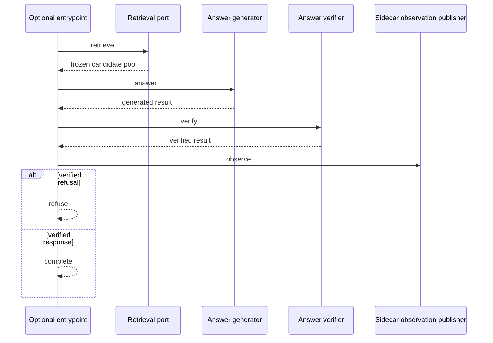

# PrimeQA Hybrid Optional Sidecar-Agent Entrypoint Train-CV/Dev Validation

Stage139 implements the optional entrypoint frozen by Stage138 and validates it
on every frozen train/dev row. The entrypoint calls a candidate-pool retrieval
port, executes the Stage137-validated orchestrator through state-aware generator
and verifier wrappers, and publishes a five-transition public-safe action trace.

The implementation and real action order passed. The entrypoint is still not
registered as a runtime option or default. Sidecar effectiveness remains
`safe_but_neutral`.

## Command

```text
python scripts/run_primeqa_hybrid_optional_sidecar_agent_entrypoint_validation.py --user-confirmed-validation --confirmation-note "user confirmed Stage139 real optional sidecar-agent entrypoint train five-fold grouped-CV and dev single-pass report-only action-trace validation after Stage138 protocol freeze; first attempt was externally interrupted without artifact and this is the single full recovery run; exact Stage137 source parity required; no candidate selection; no dev retuning; test locked; no final metrics; runtime defaults unchanged; no retries or fallback strategies"
```

## Execution History

The first full attempt ran for more than 30 minutes, but its wait channel was
interrupted before the process completed. A recovery check found no surviving
Python process and no Stage139 artifact. That attempt produced no report or
metrics and is not presented as a completed run.

The command above is the second and only completed attempt. It restarted from
the beginning and was allowed to block for the full process lifetime until it
exited naturally. It was not sampled, restarted, or stopped early.

## Entrypoint Implementation

The implementation adds four explicit boundaries:

```text
CandidatePoolRetrieverPort
SidecarAgentOrchestratorExecutionFactoryPort
StateAdvancingAnswerGenerator
StateAdvancingAnswerVerifier
```

Every request creates a fresh state machine and a fresh instrumented
orchestrator. The executed order is:



The underlying observation adapter prepares primary and sidecar channels inside
the orchestrator before generation. The `observe` action means post-verification
diagnostic publication; it does not mean sidecar data entered generation or
verification.

Errors from retrieval, generation, verification, or state transitions are
propagated directly. There is no retry, second retrieval, or fallback route.

## Data Boundary

```text
train rows: 562
train answerable rows: 370
dev rows: 121
dev answerable rows: 76
train folds: 5
candidate selection performed: false
threshold tuning performed: false
dev used for selection: false
dev used for retuning: false
test split loaded: false
final test metrics run: false
```

Current Stage128/125/80, train/dev split, and corpus SHA256 values were checked
against the saved Stage137 source fingerprints before candidate-pool execution.
All matched.

## Action Trace Result

```text
train retrieval-port calls: 562
dev retrieval-port calls: 121
missing retrieval keys: 0
candidate-pool identity violations: 0
dependency call-count violations: 0
terminal-state mismatches: 0
entrypoint trace serialization violations: 0
entrypoint trace forbidden keys: 0
entrypoint trace contract violations: 0
retry actions: 0
fallback actions: 0
```

Train terminal paths:

```text
complete: 560
refuse: 2
exact five-transition traces: 562 / 562
exact trace rate: 1.0000
```

Dev terminal paths:

```text
complete: 121
refuse: 0
exact five-transition traces: 121 / 121
exact trace rate: 1.0000
```

Every complete row followed:

```text
retrieve -> answer -> verify -> observe -> complete
```

Every refused row followed:

```text
retrieve -> answer -> verify -> observe -> refuse
```

## Train Grouped-CV

| Fold | Rows | Complete | Refuse | Candidate identity violations | Action trace violations | Call-count violations | Terminal mismatches | Retry | Fallback |
| --- | ---: | ---: | ---: | ---: | ---: | ---: | ---: | ---: | ---: |
| fold_1 | 113 | 113 | 0 | 0 | 0 | 0 | 0 | 0 | 0 |
| fold_2 | 113 | 113 | 0 | 0 | 0 | 0 | 0 | 0 | 0 |
| fold_3 | 112 | 111 | 1 | 0 | 0 | 0 | 0 | 0 | 0 |
| fold_4 | 112 | 112 | 0 | 0 | 0 | 0 | 0 | 0 | 0 |
| fold_5 | 112 | 111 | 1 | 0 | 0 | 0 | 0 | 0 | 0 |

All fifteen inherited and Stage139-specific train-CV integrity checks passed.

## Answer-Path Invariance

Train control versus entrypoint:

```text
verified average token F1: 0.1946 / 0.1946
verified F1 delta: +0.0000
verified gold citation count: 151 / 151
gold citation delta: +0
generation context identity violations: 0
verification context identity violations: 0
changed original answers: 0 / 562
changed verified answers: 0 / 562
changed verification reasons: 0 / 562
```

Dev control versus entrypoint:

```text
verified average token F1: 0.1873 / 0.1873
verified F1 delta: +0.0000
verified gold citation count: 33 / 33
gold citation delta: +0
generation context identity violations: 0
verification context identity violations: 0
changed original answers: 0 / 121
changed verified answers: 0 / 121
changed verification reasons: 0 / 121
```

Sidecar generation leaks, verification leaks, and primary-context overlaps were
zero across all 683 rows.

## Saved Stage137 Parity

Stage139 includes a built-in source-parity guard rather than relying only on the
new control runner:

```text
candidate-pool summary exact: true
train aggregate mismatched keys: []
dev aggregate mismatched keys: []
train verified F1/citations: 0.1946 / 151
dev verified F1/citations: 0.1873 / 33
overall Stage137 parity: true
```

All frozen Stage137 aggregate keys used for answer, context, sidecar, and trace
evaluation matched exactly.

## Sidecar Boundary

```text
train append opportunities / sidecar captures: 9 / 0
dev append opportunities / sidecar captures: 1 / 0
sidecar effectiveness: safe_but_neutral
```

Stage139 proves integration and action order. It does not demonstrate citation
recovery, answer-quality improvement, or retrieval improvement.

## Guard Result

```text
status: primeqa_hybrid_optional_sidecar_agent_entrypoint_train_cv_dev_validation_passed
guard checks: 45 / 45 passed
failed checks: []
optional entrypoint implementation validated: true
runtime action order validated: true
answer-path invariance validated: true
can expose optional runtime entrypoint now: true
entrypoint registered as runtime default: false
can open final test gate now: false
can run final test metrics now: false
can use test for tuning: false
runtime defaultization allowed now: false
retry actions enabled: false
fallback strategies enabled: false
default runtime policy: unchanged
public-safe forbidden keys: []
```

## Timing

```text
load protocols: 0.041 seconds
load splits and folds: 0.060 seconds
load documents and sections: 4.085 seconds
dense preflight: 28.490 seconds
build indexes: 142.730 seconds
build candidate pools: 7600.407 seconds
run control and entrypoint traces: 58.645 seconds
summarize and guard: 0.381 seconds
total: 7834.841 seconds
```

Candidate-pool construction remains the dominant engineering cost. This timing
is not an algorithm-quality result.

## Visualizations

```text
artifacts/primeqa_hybrid_optional_sidecar_agent_entrypoint_validation_stage139_visuals/stage139_train_fold_action_trace_violations.svg
artifacts/primeqa_hybrid_optional_sidecar_agent_entrypoint_validation_stage139_visuals/stage139_split_terminal_paths.svg
artifacts/primeqa_hybrid_optional_sidecar_agent_entrypoint_validation_stage139_visuals/stage139_split_answer_metric_deltas.svg
artifacts/primeqa_hybrid_optional_sidecar_agent_entrypoint_validation_stage139_visuals/stage139_stage137_source_parity.svg
artifacts/primeqa_hybrid_optional_sidecar_agent_entrypoint_validation_stage139_visuals/stage139_sidecar_isolation_violations.svg
artifacts/primeqa_hybrid_optional_sidecar_agent_entrypoint_validation_stage139_visuals/stage139_decision_flags.svg
artifacts/primeqa_hybrid_optional_sidecar_agent_entrypoint_validation_stage139_visuals/stage139_guard_check_status.svg
```

The JSON report and SVGs remain local ignored artifacts. No private per-row
trace, sample identifier, document identifier, raw text, gold label, or test
membership was written.

## Repository Verification

```text
new entrypoint/validation pytest: 17 passed
Stage136-139 integration pytest: 48 passed
Stage139 changed-file format check: 5 files already formatted
full repository ruff check: passed
full repository pytest: 436 passed
git diff check: passed
```

The repository-wide Ruff format baseline was not rewritten. Stage138 had
already established that Ruff 0.15.21 would reformat 314 unrelated historical
Python files; Stage139 changed files pass their dedicated format check.

## Decision

The optional sidecar-agent entrypoint implementation and its real train/dev
action order are validated. It is now eligible for a future explicit,
non-default runtime activation path. It is not yet wired into runtime and is
not eligible for defaultization or final-test evaluation.

## Next Step

This original handoff was superseded after the Stage139 candidate-pool timing
was reviewed as unacceptable for online retrieval. Stage140 first had to
diagnose and optimize candidate construction before any activation protocol.
That work is recorded in:

```text
docs/primeqa_hybrid_online_candidate_pool_performance_validation.md
```

Stage140 preserved every candidate-pool sequence and frozen recall count while
reducing the complete 683-row online retrieval pass from the Stage139 source
time of 7600.407 seconds to 195.427 seconds. Stage141 then froze the explicit
non-default activation protocol and strict-C warm single-request SLO in:

```text
docs/primeqa_hybrid_nondefault_runtime_activation_protocol.md
```

Stage142 subsequently completed the frozen train-CV/dev latency protocol. Its
final shared retrieval implementation was followed by another complete
Stage139 Agent regression:

```text
status: passed
guards: 45 / 45
train/dev candidate identity violations: 0 / 0
train/dev exact five-transition trace rate: 1.0 / 1.0
train/dev verified F1: 0.1946 / 0.1873
train/dev verified gold citations: 151 / 33
Stage137 aggregate parity: true
test loaded: false
retry/fallback: false / false
```

Stage143 subsequently implemented and validated the explicit non-default
single-request runtime wiring in:

```text
docs/primeqa_hybrid_optional_sidecar_runtime_validation.md
```

The entrypoint now runs behind a strict disabled-by-default process bootstrap.
Its full Stage143 train/dev runtime pass preserves Stage139 F1, citations,
terminal counts, and exact five-transition traces. It remains unregistered as
the default. Test, concurrency, retries, and fallback remain closed.
